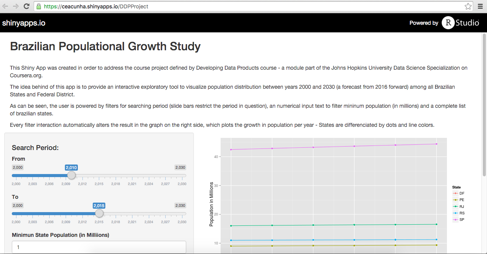

Brazilian Populational Growth Study
========================================================
author: Carlos Cunha
date: November - 22 - 2015
transition: rotate

Overview
========================================================
- Developing Data Products Course's Project

- Developed and Deployed using Shiny

- Online, Real-time Interactive 

- Available at <a href="https://ceacunha.shinyapps.io/DDPProject">shinyapps.io</a>

- Source Code and Presentation Available at <a href="https://github.com/ceacunha/DDPProject">DDPProject</a> *GitHub* repository

Application Deploy
========================================================



Main Characteristics
========================================================
1. Understand Populational Growth per Year
    + Apply Sales Strategy
    + Identify Regional Strategy
    + Create Roadmap

2. Interactive Filters
    + Brazilian States
    + Timeframe
    + Minimun Populational Threshold

Example
========================================================


```r
population <- subset(population, Year >= 2010 & State == "SP" & Population >= 10)
            
ggplot(population, aes(x = Year, y = Population, colour = State)) + geom_point() + geom_line()
```

 
